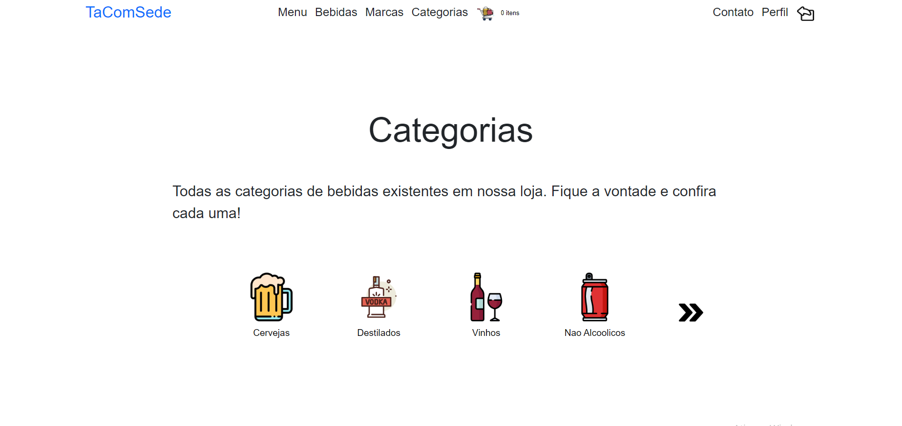
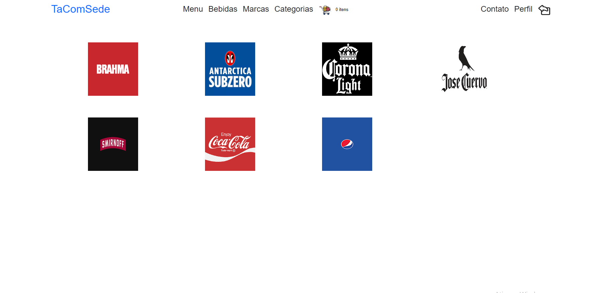
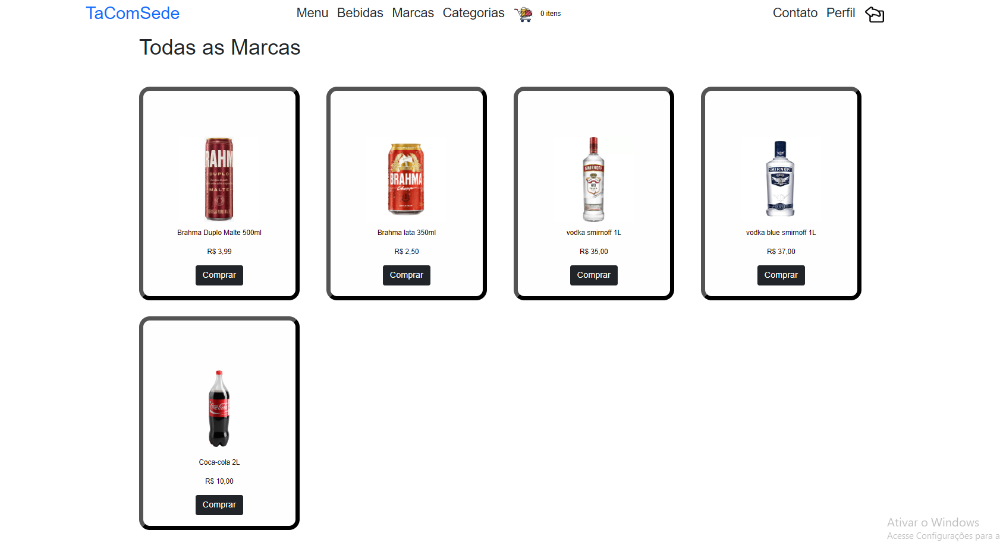
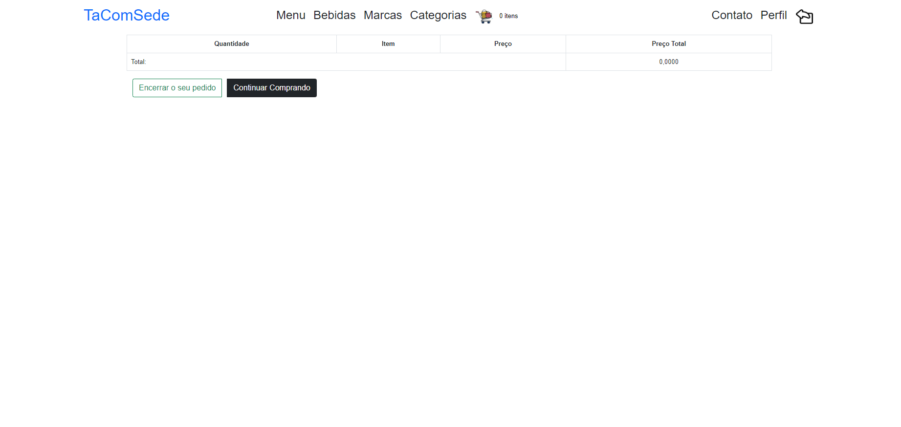

<h1 align="center"><strong>TaComSede</strong></h1>

 

<h2>About this project</h2>

This project has the idea of bringing a beneficial application to a market focused on drink and barbecue items making it easier for the user to want something without having to leave home to buy.

 

<h2>Tecnologies</h2>

This project is being done to a design pattern design MVC. I'm doing this way because I trying to learn this type of project. 

I'm using the C# language to coding, bootstrap to style the site, SQL Server to save the datas and Razor to put a C# code in a HTML 

 

<h2>Website look</h2>

<h4>1.1 Login Page</h4>

For a person who wants to use the website, they need to authenticate, that is, validate their information so that they can interact with the program. To do this, the user will have to create a type of form, passing some information to the system. He needs to fill in his email, password, CPF, and personal telephone number. All fields are mandatory so that each user can be differentiated in several ways. To achieve authentication, Identity was used, an API that helps manage personnel entry.

  

 
<h1></h1>
 

<h4>1.2 Main page</h4>

After logging in, authentication is done and takes you to the main menu. On the page in question, the user has access to the “Main”, “Profile”, “Drinks”, “Brands”, “Cart” and “Catalogs” tabs. All pages on the website have the same layout, so that the customer can navigate more easily.

  

 
<h1></h1>
 

<h4>1.3 Categories page</h4>

On the Categories screen, the customer will have a main message explaining the existing page. Just below, there is a menu of all the categories registered by the site. At the beginning, it has four sample categories and an arrow, which will show you more categories it has. When clicking on one of the categories, the user will be sent to a page with filtered drinks based on the chosen category.

  

 
<h1></h1>
 

<h4>1.4 Brand page</h4>

In brand, the user will have a screen showing all registered trademarks. Each drink has a brand in which it was inserted, for example, the Brahma brand double malt beer. When you click on one of the brand logos, a new screen will open with all the drinks from that brand, creating a filter.

  

 
<h1></h1>
 

<h4>1.5 Drinks page</h4>

In drinks, all drinks registered in the database will be shown, without differentiating brands or categories. This page is the same for the brand and category, the difference is that they have a filter passed to differentiate, avoiding code repetition. For this, partial view was used, which is basically logic that can be reused by several views.

  

 
<h1></h1>
 

<h4>1.6 ShopCart page</h4>

When clicking the buy button on a drink card, a shopping cart will be shown, which allows you to analyze a list of all purchases that will be made, the quantity of the items, the price of a specific product, the total price of the quantity and of the item price and the total price of all purchases listed in the cart. In the icon in the layout, depending on the number of items in the cart, the number will change. If the customer decides to buy more of the same product, it will not be repeated on the list, it will only change the quantity and it will be included in the final bill to reach the right price. By pressing the Continue Shopping button, the user returns to the drinks screen to continue their purchase. If you click Close your order, the desired payment method screen will change.

  

 
<h1></h1>
 
