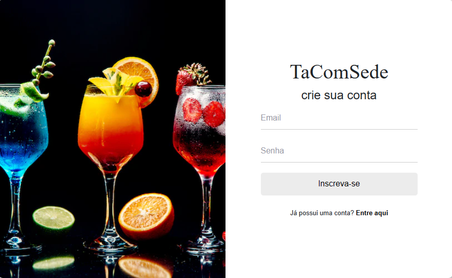
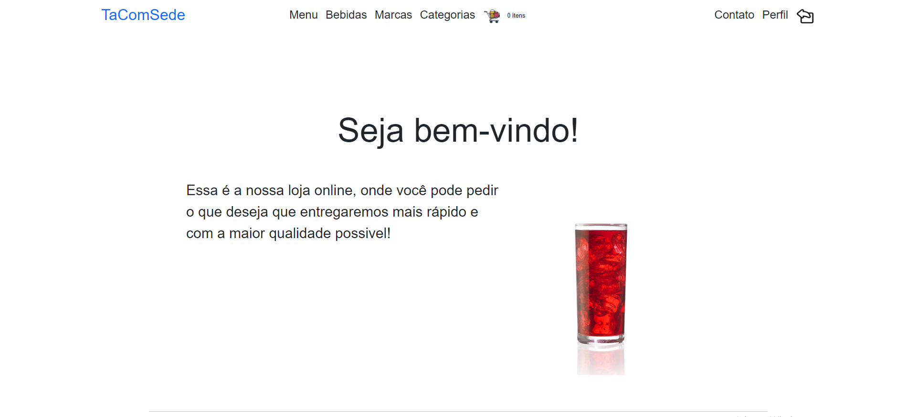

<h1 align="center"><strong>TaComSede</strong></h1>

 

<h2>About this project</h2>

This project has the idea of bringing a beneficial application to a market focused on drink and barbecue items making it easier for the user to want something without having to leave home to buy.

 

<h2>Tecnologies</h2>

This project is being done to a design pattern design MVC. I'm doing this way because I trying to learn this type of project. 

I'm using the C# language to coding, bootstrap to style the site, SQL Server to save the datas and Razor to put a C# code in a HTML 

 

<h2>Website look</h2>

<h4>1.1 Login Page</h4>

For a person who wants to use the website, they need to authenticate, that is, validate their information so that they can interact with the program. To do this, the user will have to create a type of form, passing some information to the system. He needs to fill in his email, password, CPF, and personal telephone number. All fields are mandatory so that each user can be differentiated in several ways. To achieve authentication, Identity was used, an API that helps manage personnel entry.

  

<h1></h1>
 

<h4>1.2 Main page</h4>

After logging in, authentication is done and takes you to the main menu. On the page in question, the user has access to the “Main”, “Profile”, “Drinks”, “Brands”, “Cart” and “Catalogs” tabs. All pages on the website have the same layout, so that the customer can navigate more easily.

  

